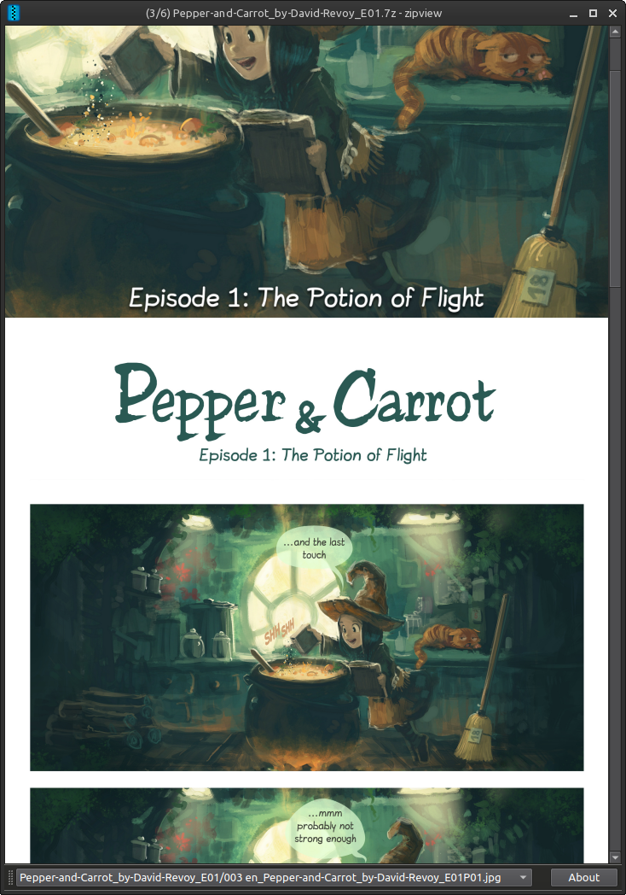

# zipview

Simple manga/comic book reader with continuous scrolling.

Opens `*.zip`, `*.cbz` and `*.7z` files.


## Usage

Drop a file in the program window or with cli:
```
zipview "/path/to/file.zip"
```

Scroll with mouse wheel or click to focus the image and use Up/Down arrow keys or Page Up/Page Down.



## Requirements
- CMake
- base-devel (gcc, make)
- Git
- Qt6
- [KArchive](https://api.kde.org/frameworks/karchive/html/index.html)
- [KImageFormats](https://api.kde.org/frameworks/kimageformats/html/index.html) (Optional, if installed provides compatibility with extra image formats)

### Archlinux
```bash
sudo pacman --needed -S base-devel cmake git qt6-base karchive
```

## Installation
```bash
git clone https://github.com/elviosak/zipview.git
cd zipview
make
sudo make install
```


### [Pepper & Carrot](https://www.peppercarrot.com/) included in examples folder (episode 1)

Open source comic licensed under [Creative Commons Attribution 4.0 International license](https://creativecommons.org/licenses/by/4.0/)

#### Attribution to:

Art: David Revoy.  
Scenario: David Revoy.  
English (original version) Proofreading: Alex Gryson, Amireeti.


#### Credit for the universe of Pepper&Carrot:

Creation: David Revoy.  
Lead Maintainer: Craig Maloney.  
Writers: Craig Maloney, Nicolas Artance, Scribblemaniac, Valvin.  
Correctors: Alex Gryson, CGand, Hali, Moini, Willem Sonke.
